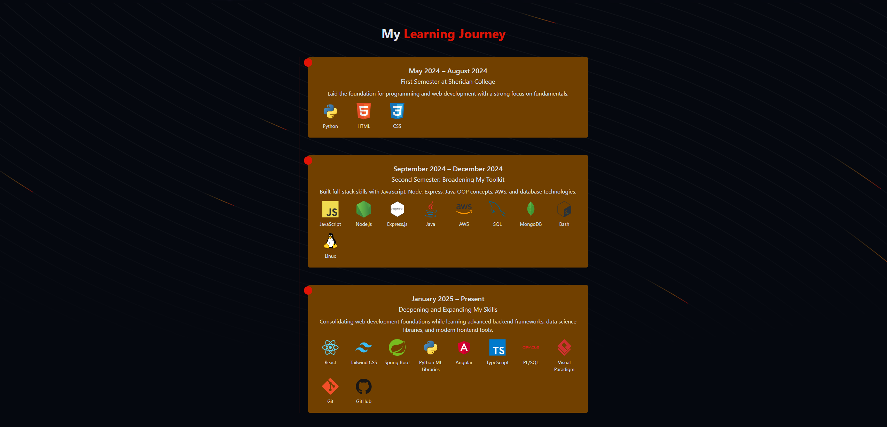

# Jimmy Dao’s Portfolio 🌐

**🎯 Purpose**  
Showcases my skills, projects, and contact info in a clean, interactive, and visually appealing format—serving as both my resume and personal brand statement.

---

## 🧩 Table of Contents

- [Demo](#demo)
- [Features](#features)
- [Tech Stack](#tech-stack)
- [Getting Started](#getting-started)
  - [Prerequisites](#prerequisites)
  - [Installation & Local Development](#installation--local-development)
- [Usage](#usage)
- [Screenshots](#screenshots)
- [Contact](#contact)
- [License](#license)

---

## Demo

Explore the live site here: **[https://jimmydao-portfolio.vercel.app](https://jimmydao-portfolio.vercel.app)**

---

## Features

- **Projects Showcase**: Clean snapshots, descriptions, and links to GitHub.
- **Responsive Design**: Mobile‑first layout powered by React and Tailwind CSS.
- **Interactive Navigation**: Animated header and smooth scrolling.
- **Contact Integration**: Simple contact links to email / LinkedIn.

---

## Tech Stack

- 🛠️ **Framework:** React
- 🎨 **Styling:** Tailwind CSS
- 💼 **Hosting:** Vercel

---

## Getting Started

### Prerequisites

Make sure you have:

- Node.js (v14+)
- npm or yarn

### Installation & Local Development

```bash
git clone https://github.com/Daojim/portfolio.git
cd portfolio
npm install      # or yarn
npm run dev      # local development at http://localhost:5173
```

## Usage

- Browse the homepage to explore my projects.
- Navigate sections via menu or links.
- Contact me using the links at the bottom.

_For contributions or feature suggestions, open an issue or PR._

---

## Screenshots




---

## Contact

- **Email:** daojim.dev@gmail.com
- **LinkedIn:** [linkedin.com/in/daojim](https://linkedin.com/in/daojim)
- **GitHub:** [@Daojim](https://github.com/Daojim)

